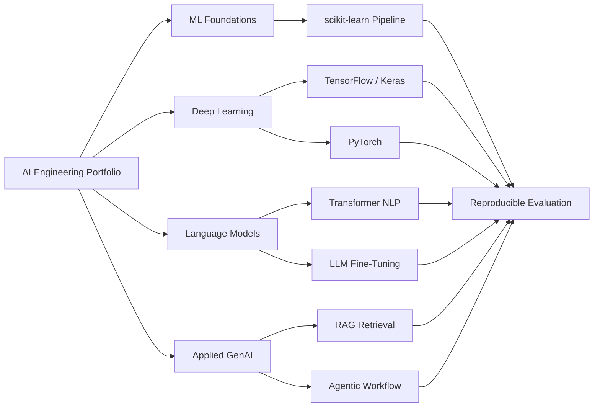

# Portfolio Architecture

## Design Principles
The repository separates classical ML, deep learning, language-model engineering and applied GenAI into focused demonstrations. Generated models, private datasets and runtime artifacts are excluded from source control. Claims are limited to what the committed implementation or credential supports.
